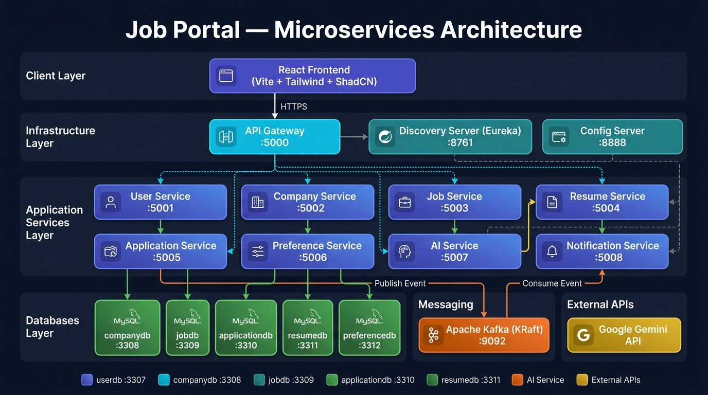

<h1 align="center">🚀 Job Portal — AI-Powered Microservices Application</h1>

<p align="center">
  A production-ready, full-stack job portal built with <strong>Spring Boot microservices</strong> on the backend and <strong>React + Vite</strong> on the frontend. Features AI-powered job matching, resume building, employer AI screening, and smart career tools powered by <strong>Google Gemini</strong>.
</p>

<p align="center">
  
  
  
  
  
  
</p>

---

## 📋 Table of Contents

- [Architecture](#-architecture)
- [Tech Stack](#-tech-stack)
- [Microservices Overview](#-microservices-overview)
- [Frontend Features](#-frontend-features)
- [Project Structure](#-project-structure)
- [Getting Started](#-getting-started)
- [Environment Variables](#-environment-variables)
- [API Gateway Routes](#-api-gateway-routes)
- [Key Design Patterns](#-key-design-patterns)

---

## 🏗️ Architecture



The system follows a **microservices architecture** with each domain service owning its own database. All client traffic flows through a central **API Gateway** that handles routing and JWT authentication. Services register themselves with a **Eureka Discovery Server** and pull configuration from a central **Config Server**.

---

## 🛠️ Tech Stack

### Backend
| Technology | Version | Purpose |
|---|---|---|
| Java | 17 | Core language |
| Spring Boot | 4.0.2 | Microservice framework |
| Spring Cloud Gateway | 2025.1.1 | API Gateway + routing |
| Netflix Eureka | 2025.1.1 | Service discovery |
| Spring Cloud Config | 2025.1.1 | Centralized configuration |
| Apache Kafka | 4.2.0 | Async event messaging (KRaft mode) |
| MySQL | 8.0 | Relational database (per service) |
| JJWT | 0.13.0 | JWT token generation & validation |
| Google Gemini | — | AI features (matching, screening, tools) |
| Docker + Jib | — | Containerization |
| Lombok | 1.18.36 | Boilerplate reduction |

### Frontend
| Technology | Version | Purpose |
|---|---|---|
| React | 19 | UI framework |
| Vite | 8 | Build tool & dev server |
| Tailwind CSS | 4 | Styling |
| ShadCN UI | — | Component library |
| Redux Toolkit | 2.12 | Global state management |
| React Router | 7 | Client-side routing |
| React Hook Form + Zod | — | Form handling & validation |
| Axios | — | HTTP client |
| Sonner | — | Toast notifications |

---

## ⚙️ Microservices Overview

### ☁️ Infrastructure Services

| Service | Port | Description |
|---|---|---|
| **Discovery Server** | `8761` | Netflix Eureka — all services register here for dynamic discovery |
| **Config Server** | `8888` | Centralized Spring Cloud Config — serves properties to all services |
| **API Gateway** | `5000` | Single entry point — routes requests and validates JWT tokens |

### 🔧 Application Services

| Service | Port | Database | Description |
|---|---|---|---|
| **User Service** | `5001` | `job_portal_user_db` | Registration, login, JWT issuance, user profile management |
| **Company Service** | `5002` | `job_portal_company_db` | Employer company profile CRUD operations |
| **Job Service** | `5003` | `job_portal_job_db` | Job listing creation, search, filtering, and management |
| **Resume Service** | `5004` | `job_portal_resume_db` | Resume builder — create, edit, and view formatted resumes |
| **Application Service** | `5005` | `job_portal_application_db` | Job applications lifecycle; publishes Kafka events on status changes |
| **Preference Service** | `5006` | `job_portal_preference_db` | User job preferences for personalized AI recommendations |
| **AI Service** | `5007` | — | Google Gemini integration — AI job matching, resume analysis, employer AI screening |
| **Notification Service** | `5008` | — | Consumes Kafka events → sends email notifications to users |

### 📦 Common Library
A shared Maven module (`common-lib`) containing shared DTOs, exception classes, and utilities used across all services to avoid duplication.

---

## 🖥️ Frontend Features

### 🌐 Public Pages
| Route | Description |
|---|---|
| `/` | Landing page — Hero, Features, For Candidates, For Employers, How It Works, Stats, CTA |
| `/login` | User authentication |
| `/register` | New account creation |
| `/forgot-password` | Password reset request |

### 👤 Job Seeker (Role: `ROLE_JOB_SEEKER`)
| Route | Description |
|---|---|
| `/jobs` | Browse and filter all job listings |
| `/jobs/:id` | Detailed job view with company info |
| `/apply/:id` | Apply for a specific job |
| `/applications` | Track all application statuses |
| `/saved-jobs` | Bookmarked job listings |
| `/resumes` | Manage multiple resumes |
| `/resumes/:id/edit` | Full-featured resume editor |
| `/resumes/:id/view` | Resume preview / export view |
| `/ai-match` | AI-powered job matching based on profile |
| `/ai-tools` | AI career tools (cover letters, interview prep, etc.) |
| `/profile` | View and edit user profile |
| `/settings` | Account and notification settings |

### 🏢 Employer (Role: `ROLE_EMPLOYER`)
| Route | Description |
|---|---|
| `/employer/dashboard` | Overview — metrics, recent applications, active jobs |
| `/employer/jobs` | Manage all posted job listings |
| `/employer/jobs/create` | Post a new job |
| `/employer/jobs/:id/edit` | Edit an existing job listing |
| `/employer/applications` | View all applications across all jobs |
| `/employer/applications/:id` | Detailed view of a single application |
| `/employer/applications/:id/screening` | AI-powered screening result for an application |
| `/employer/candidates` | Browse candidate pool |
| `/employer/ai-screening` | AI screening dashboard with analytics (pie charts, donut charts) |
| `/employer/messages` | Messaging with candidates |
| `/employer/company` | Manage company profile |
| `/employer/billing` | Billing overview and current plan |
| `/employer/billing/plans` | View and upgrade subscription plans |
| `/employer/billing/payment` | Payment method management |
| `/employer/billing/invoices` | Invoice history |
| `/employer/settings` | Employer account settings |

### 🛡️ Admin (Role: `ROLE_ADMIN`)
| Route | Description |
|---|---|
| `/admin/dashboard` | Platform overview — key metrics |
| `/admin/users` | Manage all registered users |
| `/admin/jobs` | Manage all job listings platform-wide |
| `/admin/companies` | Manage all registered companies |
| `/admin/job-meta` | Manage job categories, skills, and metadata |
| `/admin/subscriptions` | Manage subscription plans and billing |
| `/admin/settings` | Admin panel settings |

---

## 📁 Project Structure

```
Job-portal-Application/
│
├── Backend/                               # Spring Boot multi-module Maven project
│   ├── pom.xml                            # Parent POM — manages all dependencies
│   ├── cloud/                             # Infrastructure services
│   │   ├── job-portal-discovery/          # Eureka Discovery Server
│   │   ├── job-portal-config-server/      # Spring Cloud Config Server
│   │   └── job-portal-gateway/            # API Gateway (JWT filter + routing)
│   ├── common-lib/                        # Shared DTOs, exceptions, utilities
│   └── services/                          # Business microservices
│       ├── job-portal-user-service/
│       ├── job-portal-company-service/
│       ├── job-portal-job-service/
│       ├── job-portal-resume-service/
│       ├── job-portal-application-service/
│       ├── job-portal-preference-service/
│       ├── job-portal-ai-service/
│       └── job-portal-notification-service/
│
├── job-portal-ai-frontend/                # React + Vite frontend
│   ├── src/
│   │   ├── pages/
│   │   │   ├── auth/                      # Login, Register, ForgotPassword
│   │   │   ├── user/                      # All job seeker pages
│   │   │   ├── employer/                  # Employer dashboard & management
│   │   │   │   ├── billing/               # BillingOverview, Plans, Payment, Invoices
│   │   │   │   ├── AiScreening/           # AI screening analytics & charts
│   │   │   │   └── Applications/          # ApplicationDetail view
│   │   │   └── admin/                     # Admin panel pages
│   │   ├── components/
│   │   │   ├── auth/                      # ProtectedRoute, RoleBasedRoute, AppBootstrap
│   │   │   ├── user/                      # User layout, sidebar, navbar
│   │   │   ├── employer/                  # Employer layout, dashboard components
│   │   │   ├── admin/                     # Admin layout and components
│   │   │   └── ui/                        # Reusable ShadCN UI components
│   │   ├── store/                         # Redux Toolkit state management
│   │   │   ├── user/                      # Auth & user profile state
│   │   │   ├── ai/                        # AI features state
│   │   │   ├── application/               # Job application state
│   │   │   ├── company/                   # Company profile state
│   │   │   ├── job/                       # Job listings state
│   │   │   ├── resume/                    # Resume management state
│   │   │   ├── savedJob/                  # Saved jobs state
│   │   │   ├── jobMeta/                   # Job categories & metadata state
│   │   │   └── subscription/              # Billing & subscription state
│   │   ├── hooks/                         # Custom React hooks (useAuth, etc.)
│   │   ├── utils/                         # API helpers, Axios config
│   │   └── validations/                   # Zod schemas for forms
│   └── package.json
│
└── docker/
    ├── docker-compose.yml                 # Full stack orchestration (16+ containers)
    ├── .env                               # Secret environment variables
    └── .env.example                       # Template for env setup
```

---

## 🚀 Getting Started

### Prerequisites
- [Docker Desktop](https://www.docker.com/products/docker-desktop/) installed and running
- [Node.js](https://nodejs.org/) v18+ (for frontend development only)
- [Java 17](https://adoptium.net/) + Maven (for backend development only)

### 1. Clone the Repository
```bash
git clone https://github.com/mohit2978/Job-portal-Application.git
cd Job-portal-Application
```

### 2. Configure Environment Variables
```bash
cd docker
cp .env.example .env
# Edit .env and fill in your values (see Environment Variables section)
```

### 3. Run with Docker Compose
```bash
cd docker
docker-compose up -d
```

This spins up **all 16+ containers** including databases, Kafka, and all microservices automatically.

### 4. Run the Frontend (Development)
```bash
cd job-portal-ai-frontend
npm install
npm run dev
```

Frontend will be available at `http://localhost:5173`

### Service Health Check URLs
| Service | Health URL |
|---|---|
| Eureka Dashboard | http://localhost:8761 |
| Config Server | http://localhost:8888/actuator/health |
| API Gateway | http://localhost:5000/actuator/health |
| User Service | http://localhost:5001/actuator/health |

---

## 🔐 Environment Variables

Create a `.env` file inside the `docker/` directory based on `.env.example`:

```env
# Database password (shared across all MySQL instances)
DB_PASSWORD=your_strong_password

# Spring Cloud Config encryption key
ENCRYPT_KEY=your_encrypt_key

# Google Gemini API key (for AI features)
GEMINI_API_KEY=your_gemini_api_key

# Email password (for notification service - Gmail App Password recommended)
MAIL_PASSWORD=your_mail_app_password
```

---

## 🌐 API Gateway Routes

All API calls go through the gateway at `http://localhost:5000`.

| Path Prefix | Routed To |
|---|---|
| `/api/users/**` | User Service `:5001` |
| `/api/companies/**` | Company Service `:5002` |
| `/api/jobs/**` | Job Service `:5003` |
| `/api/resumes/**` | Resume Service `:5004` |
| `/api/applications/**` | Application Service `:5005` |
| `/api/preferences/**` | Preference Service `:5006` |
| `/api/ai/**` | AI Service `:5007` |

> 🔒 All routes except `/api/users/auth/**` require a valid `Authorization: Bearer <token>` header.

---

## 🧩 Key Design Patterns

| Pattern | Implementation |
|---|---|
| **Microservices** | Each business domain is a fully independent Spring Boot service |
| **Database per Service** | 6 isolated MySQL instances — no shared database state |
| **API Gateway** | Centralized routing + JWT validation via Spring Cloud Gateway |
| **Service Discovery** | Netflix Eureka — services register and discover each other dynamically |
| **Centralized Configuration** | Spring Cloud Config Server distributes all service configs |
| **Event-Driven Architecture** | Application Service → Kafka → Notification Service (async, decoupled) |
| **Role-Based Access Control** | Three roles: `ROLE_JOB_SEEKER`, `ROLE_EMPLOYER`, `ROLE_ADMIN` — enforced at gateway and frontend via `RoleBasedRoute` |
| **Common Library** | Shared Maven module for DTOs/exceptions to avoid code duplication |
| **Protected Routes** | `ProtectedRoute` + `RoleBasedRoute` components guard all authenticated pages |
| **Containerization** | All services packaged as Docker images via Google Jib Maven Plugin |

---

## 🐳 Docker Images

All backend services are pre-built and published to Docker Hub under:

```
mohitk004/job-portal-<service-name>:1.0.0
```

| Image |
|---|
| `mohitk004/job-portal-discovery:1.0.0` |
| `mohitk004/job-portal-config-server:1.0.0` |
| `mohitk004/job-portal-gateway:1.0.0` |
| `mohitk004/job-portal-user-service:1.0.0` |
| `mohitk004/job-portal-company-service:1.0.0` |
| `mohitk004/job-portal-job-service:1.0.0` |
| `mohitk004/job-portal-resume-service:1.0.0` |
| `mohitk004/job-portal-application-service:1.0.0` |
| `mohitk004/job-portal-preference-service:1.0.0` |
| `mohitk004/job-portal-ai-service:1.0.0` |
| `mohitk004/job-portal-notification-service:1.0.0` |

---

<p align="center">Built with ❤️ by <strong>Mohit</strong></p>
